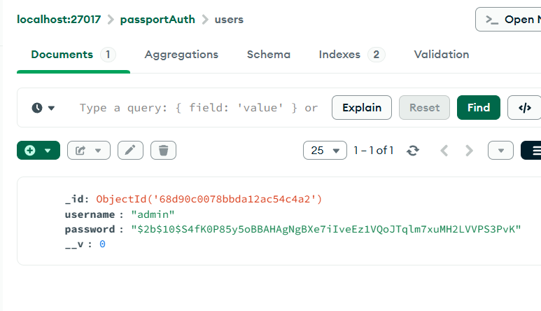

# Local Passport Website

Complete website demo project using Passport.js with Local Strategy and EJS templates.

## Overview

This project demonstrates how to implement a complete website authentication using:
- **Passport.js**: Authentication framework for Node.js
- **Local Strategy**: Username/password authentication
- **EJS Templates**: Template engine for web pages
- **Express Session**: Server-side session management
- **bcryptjs**: Password encryption
- **Mongoose**: ODM for MongoDB

## Features

- ✅ Registration page (Register form)
- ✅ Login page (Login form)
- ✅ Protected profile page
- ✅ Session-based authentication with Passport.js
- ✅ Password hashing with bcrypt
- ✅ Redirect after login/logout
- ✅ Middleware for route protection

## Installation

```bash
npm install
```

## Dependencies

* **express**
* **mongoose**
* **passport**
* **passport-local**
* **express-session**
* **bcryptjs**
* **ejs**

---

## Usage

### Prerequisites

Ensure MongoDB is running on `mongodb://127.0.0.1:27017`

### Run the application

```bash
node app.js
```

Server will run on `http://localhost:3000`

---

## Web Routes & Test (LAB requirements)

### 1. Registration Page - `GET /register`

Displays registration form.

📸 

* 
 — Registration page in browser.

---

### 2. Handle Registration - `POST /register`

Creates new account and redirects to login.

**Process:**

1. Receive username/password from form
2. Hash password with bcrypt
3. Save user to MongoDB
4. Redirect to `/login`

**HINT:** Check DB after registration:

```bash
mongosh
use passportAuth
db.users.find().pretty()
```

📸 

* 
 — Redirect to login page.
* 
 — New user in MongoDB.

---

### 3. Login Page - `GET /login`

Displays login form.

📸 

*  
— Login page in browser.

---

### 4. Handle Login - `POST /login`

**HINT:**

* If login correct → redirect to `/profile`.
* If incorrect → redirect back to `/login`.

📸 

* 
 — Redirect to profile page after successful login.

---

### 5. Profile Page - `GET /profile` (Protected Route)

Displays user information (only for logged-in users).

**Middleware Protection:**

```javascript
function isAuthenticated(req, res, next) {
  if (req.isAuthenticated()) return next();
  res.redirect("/login");
}
```

**HINT:** If not logged in, will redirect to `/login`.

📸 

*  
— Profile page showing username.

---

### 6. Logout - `GET /logout`

Clears session and redirects to login.

**Process:**

1. Call `req.logout()`
2. Redirect to `/login`

📸 

* 
 — Redirect to login page after logout.

---

## Website Operation Flow

1. **Visit `/register`** → Fill form → POST `/register` → Redirect `/login`
2. **Visit `/login`** → Fill form → POST `/login` → Passport authenticate
3. **If successful** → Redirect `/profile` (create session)
4. **If failed** → Redirect `/login`
5. **Access `/profile`** → Check `isAuthenticated()` → Display or redirect
6. **Click logout** → `GET /logout` → Clear session → Redirect `/login`

---

## Directory Structure

```
local_passport_website/
├── app.js                    # Entry point
├── package.json             # Dependencies
├── config/
│   └── passport.js          # Passport Local Strategy
├── models/
│   └── User.js              # User model with bcrypt
├── routes/
│   └── auth.js              # Web routes (GET/POST)
├── views/
│   ├── login.ejs            # Login form
│   ├── register.ejs         # Register form
│   └── profile.ejs          # Protected profile page
└── README.md               # This file
```
---

## Author: Do Cong Danh